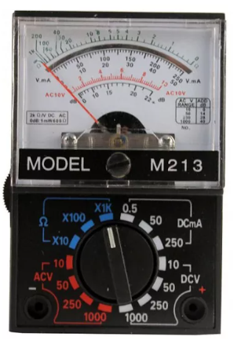
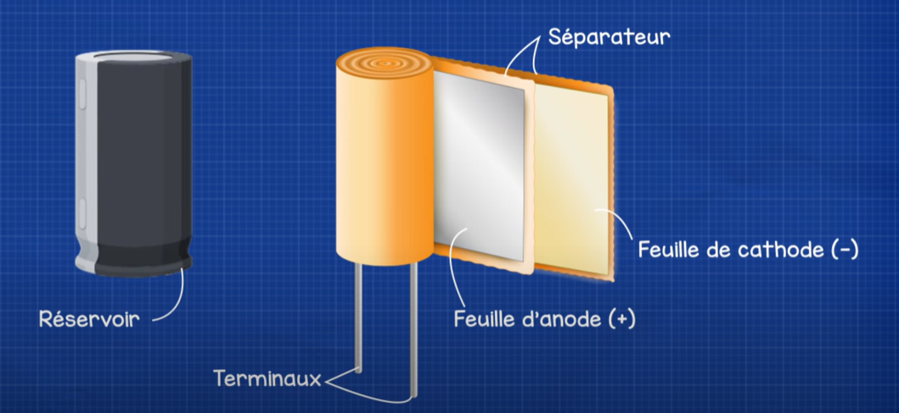
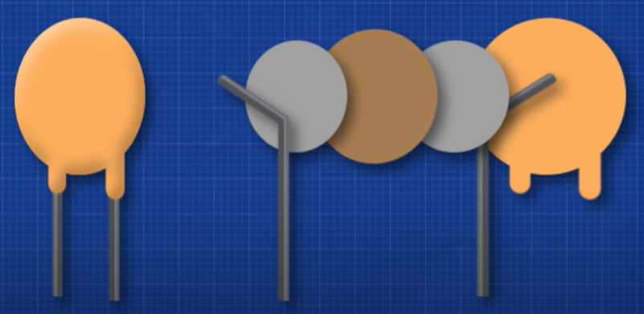
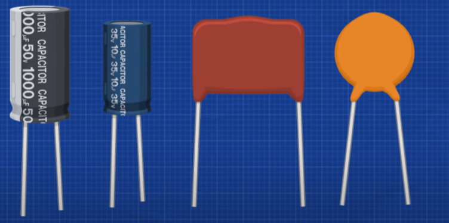
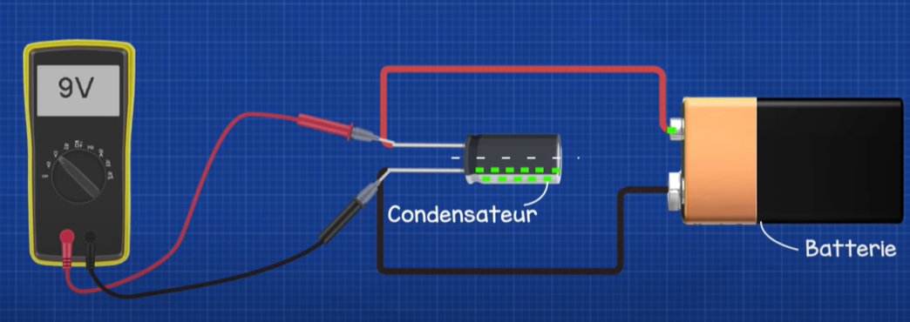
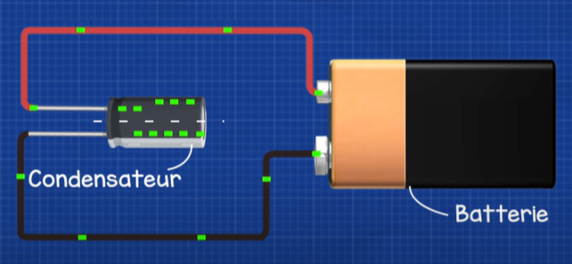

<p align="center">
  
</p>

<h1 align="center">NutriForge AI</h1>

<p align="center">
  An AI-powered full stack fitness and nutrition platform trained on real Kaggle datasets.
  <br/>
  Built with React, FastAPI, scikit-learn, and XGBoost.
</p>

<p align="center">
  
  
  
  
  
  
</p>

---

## Screenshots

<table>
  <tr>
    <td align="center"><b>Login</b></td>
    <td align="center"><b>Dashboard + ML Predictions</b></td>
  </tr>
  <tr>
    <td></td>
    <td></td>
  </tr>
  <tr>
    <td align="center"><b>Nutrition</b></td>
    <td align="center"><b>Workout Plan</b></td>
  </tr>
  <tr>
    <td></td>
    <td></td>
  </tr>
  <tr>
    <td align="center"><b>Supplements</b></td>
    <td align="center"><b>AI Chat</b></td>
  </tr>
  <tr>
    <td></td>
    <td></td>
  </tr>
  <tr>
    <td align="center"><b>Progress Tracker</b></td>
    <td></td>
  </tr>
  <tr>
    <td></td>
    <td></td>
  </tr>
</table>

---

## What is NutriForge AI?

NutriForge AI is a graduation project that combines machine learning, a REST API backend, and a modern React frontend into a complete fitness assistant. Users enter their profile — age, weight, height, goal, and experience level — and the platform uses trained ML models to deliver personalized nutrition plans, workout recommendations, and health risk assessments in real time.

---

## Features

- **ML Predictions** — 4 trained models running on real Kaggle fitness data
- **Calorie Calculator** — predicts calories burned per session using XGBoost
- **Macro Recommender** — daily protein, fat, carbs, and calorie targets
- **Health Risk Classifier** — Low / Medium / High risk assessment using obesity data
- **Workout Intensity Recommender** — Light / Moderate / Active / Intense
- **AI Fitness Chat** — powered by Groq LLaMA 3.3 70B
- **Meal Planner** — AI-generated daily meal plans
- **Supplement Advisor** — personalized supplement stack
- **Progress Tracker** — log and visualize body stats over time
- **Water Tracker** — daily hydration goals
- **Workout Timer** — built-in session timer
- **JWT Authentication** — secure login and registration

---

## ML Models

All models were trained in Google Colab using real Kaggle datasets.

| Model | Algorithm | Dataset | Output |
|---|---|---|---|
| Calorie Predictor | XGBoost Regression | Gym Members Exercise | calories burned / session |
| Macro Recommender | Multi-output XGBoost | Gym Members + Mifflin formula | protein / fat / carbs / daily kcal |
| Health Risk Classifier | XGBoost + SMOTE | Obesity Prediction Dataset | Low / Medium / High |
| Workout Recommender | XGBoost Classifier | Gym Members Exercise | Light / Moderate / Active / Intense |

### Kaggle Datasets Used

- [Gym Members Exercise Dataset](https://www.kaggle.com/datasets/valakhorasani/gym-members-exercise-dataset)
- [Obesity Prediction Dataset](https://www.kaggle.com/datasets/mrsimple07/obesity-prediction)
- [BMI Dataset](https://www.kaggle.com/datasets/yasserh/bmidataset)

---

## Tech Stack

**Frontend**
- React 18 + Vite
- Tailwind CSS
- Framer Motion
- Axios

**Backend**
- FastAPI
- SQLite + SQLAlchemy
- JWT Authentication
- Pydantic

**Machine Learning**
- scikit-learn
- XGBoost
- imbalanced-learn (SMOTE)
- pandas, numpy
- joblib

**AI**
- Groq API (LLaMA 3.3 70B)

---

## Project Structure

```
nutriforge-ai/
├── nutriforge-frontend/        React frontend
│   └── src/
│       ├── pages/              Dashboard, Auth, Nutrition, Workout, Chat...
│       ├── components/         WaterTracker, WorkoutTimer...
│       └── api.js              Axios instance
│
└── nutriforge-api/             FastAPI backend
    ├── app/
    │   ├── routers/            users, nutrition, workout, supplements,
    │   │                       progress, chat, ml_predictions
    │   ├── models/             SQLAlchemy models
    │   ├── services/           ML engines, auth service
    │   └── main.py             FastAPI app entry point
    └── ml/
        └── models/             Trained .pkl model files
```

---

## Getting Started

### Prerequisites

- Python 3.12
- Node.js 18+
- Groq API key (free at console.groq.com)

### Backend

```bash
cd nutriforge-api
python -m venv venv
venv\Scripts\activate
pip install -r requirements.txt
```

Create a `.env` file inside `nutriforge-api`:
```
GROQ_API_KEY=your_groq_api_key_here
```

Start the server:
```bash
uvicorn app.main:app --reload
```

API runs at `http://localhost:8000`
API docs at `http://localhost:8000/docs`

### Frontend

```bash
cd nutriforge-frontend
npm install
npm run dev
```

Frontend runs at `http://localhost:5173`

---

## API Endpoints

| Method | Endpoint | Description |
|---|---|---|
| POST | /api/users/register | Register new user |
| POST | /api/users/login | Login |
| GET | /api/users/profile | Get user profile |
| POST | /api/nutrition/macros | Calculate daily macros |
| GET | /api/nutrition/bmi | Calculate BMI |
| POST | /api/nutrition/meal-plan | Generate AI meal plan |
| GET | /api/workout/plan | Get workout plan |
| POST | /api/supplements/plan | Get supplement recommendations |
| POST | /api/progress/log | Log progress entry |
| POST | /api/chat/message | AI fitness chat |
| POST | /api/ml/predict | Run all 4 ML models |

---

## License

This project is licensed under the MIT License. See [LICENSE](LICENSE) for details.

---

<p align="center">Built as a graduation project — NutriForge AI 2026</p>
